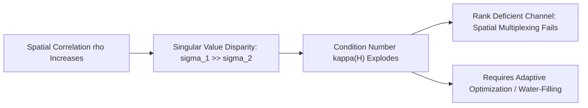

# Stage 1: Spatially Correlated Rayleigh MIMO Channel Modeling

## 1. Overview & Objectives
In real-world 5G deployments (especially at sub-6 GHz and mmWave frequencies), antenna elements at the base station and user equipment (UE) experience **spatial correlation** due to limited angular spread, tight antenna spacing ($<\lambda/2$), and insufficient scattering.

This stage models a fixed $N_t \times N_r$ MIMO Rayleigh flat-fading channel under arbitrary spatial correlation levels and analyzes its mathematical conditioning.

---

## 2. Mathematical Formulation

### 2.1 The Kronecker Correlation Model
The full MIMO channel matrix $\mathbf{H} \in \mathbb{C}^{N_r \times N_t}$ with transmit correlation matrix $\mathbf{R}_{Tx}$ and receive correlation matrix $\mathbf{R}_{Rx}$ is expressed using the Kronecker product model:

$$\mathbf{H} = \mathbf{R}_{Rx}^{1/2} \mathbf{H}_{iid} \left(\mathbf{R}_{Tx}^{1/2}\right)^T$$

Where:
* $\mathbf{H}_{iid} \sim \mathcal{CN}(0, \mathbf{I}_{N_r} \otimes \mathbf{I}_{N_t})$ is the uncorrelated independent identically distributed Rayleigh fading matrix whose elements satisfy $h_{ij} = \frac{1}{\sqrt{2}}(u + jv)$ with $u, v \sim \mathcal{N}(0, 1)$.
* $\mathbf{R}_{Tx}$ and $\mathbf{R}_{Rx}$ are modeled using the exponential correlation model:
  $$[\mathbf{R}_{Tx}]_{i,j} = \rho_{tx}^{|i - j|}, \quad [\mathbf{R}_{Rx}]_{i,j} = \rho_{rx}^{|i - j|}$$
  where $\rho \in [0, 1)$ is the spatial correlation coefficient.

### 2.2 Singular Value Decomposition & Condition Number
Applying Singular Value Decomposition (SVD):
$$\mathbf{H} = \mathbf{U} \mathbf{\Sigma} \mathbf{V}^H$$
where $\mathbf{\Sigma} = \text{diag}(\sigma_1, \sigma_2, \dots, \sigma_{\min(N_t, N_r)})$ contains ordered singular values $\sigma_1 \ge \sigma_2 \ge \dots \ge 0$.

The **Condition Number** of the channel matrix is defined as:
$$\kappa(\mathbf{H}) = \frac{\sigma_{max}(\mathbf{H})}{\sigma_{min}(\mathbf{H})} = \frac{\sigma_1}{\sigma_2}$$

* **Well-Conditioned Channel ($\kappa \approx 1$):** Spatial sub-channels are orthogonal; ideal for full rank spatial multiplexing.
* **Ill-Conditioned Channel ($\kappa \gg 1$):** Spatial sub-channels are collinear; linear spatial multiplexing (ZF) causes catastrophic noise amplification.

---

## 3. Files in this Folder

| File | Description |
|---|---|
| [`generate_correlated_channel.m`](generate_correlated_channel.m) | Vectorized function generating $N_t \times N_r \times K$ correlated Rayleigh channel realizations. |
| [`test_channel_statistics.m`](test_channel_statistics.m) | Statistical validation script analyzing singular value PDFs and condition number growth across correlation sweeps. |
| [`figures/`](figures/) | Contains exported analytical figures and distribution plots. |

---

## 4. Key Results & Observations

### 4.1 Singular Value Distribution

### 4.2 Channel Condition Number Growth

1. **Singular Value Degradation:** As $\rho \to 1$, the second singular value $\sigma_2 \to 0$, concentrating all channel energy into the dominant spatial mode $\sigma_1$.
2. **Exponential Condition Number Growth:** At $\rho = 0$, mean condition number is $\approx 3.5$. At $\rho = 0.9$, mean condition number exceeds $25$, confirming the necessity of adaptive rank and water-filling power allocation.

