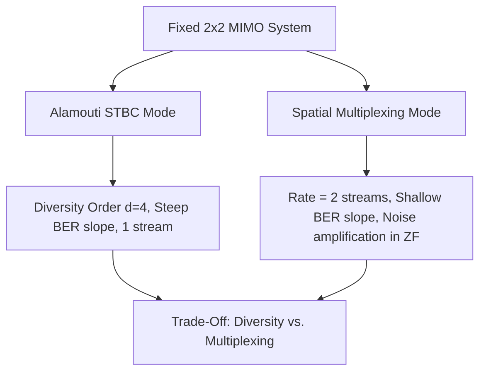

# Stage 2: Baseline Transceiver Architectures (Diversity vs. Spatial Multiplexing)

## 1. Overview
In a fixed $2 \times 2$ MIMO configuration, multiple antennas can be used in two fundamentally distinct operational modes:
1. **Transmit Diversity (Alamouti STBC):** Replicates symbols across space and time to maximize link reliability against deep fades.
2. **Spatial Multiplexing (V-BLAST / Linear):** Transmits independent parallel data streams simultaneously over the same bandwidth to maximize data throughput.

---

## 2. Mathematical Principles

### 2.1 Alamouti $2 \times 2$ Space-Time Block Coding (STBC)
The Alamouti code maps two consecutive symbols $[s_1, s_2]$ across 2 transmit antennas over 2 symbol periods:

$$\mathbf{S} = \frac{1}{\sqrt{2}} \begin{bmatrix} s_1 & -s_2^* \\ s_2 & s_1^* \end{bmatrix}$$

At the receiver:
$$\begin{bmatrix} r_1(t_1) \\ r_2(t_1) \\ r_1^*(t_2) \\ r_2^*(t_2) \end{bmatrix} = \frac{1}{\sqrt{2}} \begin{bmatrix} h_{11} & h_{12} \\ h_{21} & h_{22} \\ h_{12}^* & -h_{11}^* \\ h_{22}^* & -h_{21}^* \end{bmatrix} \begin{bmatrix} s_1 \\ s_2 \end{bmatrix} + \begin{bmatrix} n_1(t_1) \\ n_2(t_1) \\ n_1^*(t_2) \\ n_2^*(t_2) \end{bmatrix}$$

Because the equivalent virtual channel matrix columns are orthogonal, Maximum Ratio Combining (MRC) decouples $s_1$ and $s_2$ with zero cross-stream interference, achieving a full diversity order of:
$$d = N_t \times N_r = 2 \times 2 = 4$$

### 2.2 Spatial Multiplexing with Linear Receivers
Transmitting independent vector $\mathbf{x} = [s_1, s_2]^T$ with equal power allocation $P_1 = P_2 = 1/2$. The received signal is:
$$\mathbf{y} = \mathbf{H}\mathbf{x} + \mathbf{n}$$

#### Zero-Forcing (ZF) Receiver
Eliminates inter-stream interference by applying the Moore-Penrose pseudo-inverse:
$$\mathbf{W}_{ZF} = (\mathbf{H}^H\mathbf{H})^{-1}\mathbf{H}^H$$
$$\mathbf{\hat{x}}_{ZF} = \mathbf{x} + (\mathbf{H}^H\mathbf{H})^{-1}\mathbf{H}^H\mathbf{n}$$

* **Noise Amplification:** The post-detection noise variance on stream $i$ is $\sigma_{n,i}^2 = \sigma_n^2 [(\mathbf{H}^H\mathbf{H})^{-1}]_{i,i}$. When $\mathbf{H}$ has small singular values (ill-conditioned), noise is heavily amplified.

#### Minimum Mean Square Error (MMSE) Receiver
Optimizes the trade-off between interference suppression and noise enhancement by minimizing $\mathbb{E}[\|\mathbf{W}\mathbf{y} - \mathbf{x}\|^2]$:
$$\mathbf{W}_{MMSE} = (\mathbf{H}^H\mathbf{H} + \sigma_n^2 N_t \mathbf{I}_{N_t})^{-1}\mathbf{H}^H$$

---

## 3. Files in this Folder

| File | Description |
|---|---|
| [`alamouti_stbc_2x2.m`](alamouti_stbc_2x2.m) | Complete $2 \times 2$ Alamouti space-time encoder and MRC combiner function. |
| [`spatial_multiplexing_linear.m`](spatial_multiplexing_linear.m) | $2 \times 2$ Spatial multiplexing transceiver with ZF and MMSE detectors. |
| [`run_baseline_comparison.m`](run_baseline_comparison.m) | Comparative Monte Carlo simulation runner generating BER curves and noise enhancement histograms. |
| [`figures/`](figures/) | Contains exported analytical figures and comparison plots. |

---

## 4. Key Results & Conclusions

### 4.1 Comparative BER Performance

### 4.2 Zero-Forcing Noise Enhancement Distribution

* **Steep Diversity Slope:** Alamouti STBC achieves a steep BER drop (diversity order $d=4$), making it robust at low-to-medium SNRs.
* **Throughput Multiplier:** Spatial Multiplexing doubles the transmission rate but suffers higher error rates at low SNR, necessitating the optimization strategies developed in Stage 3.

