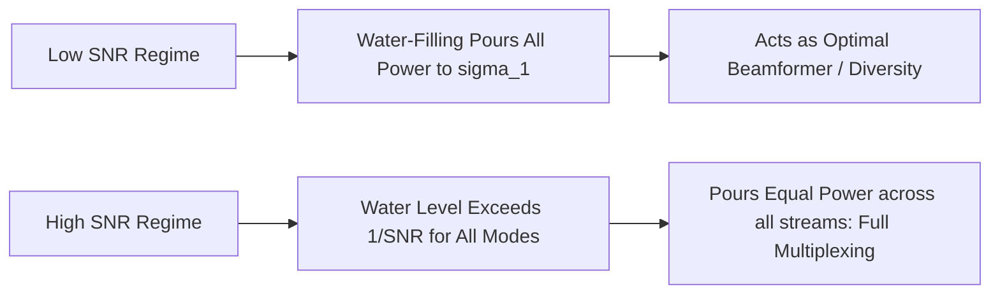

# Stage 3: Multiplexing Optimization via SVD and Water-Filling

## 1. Overview & Motivation
For a fixed antenna count (e.g. $2 \times 2$ MIMO), unprecoded equal-power spatial multiplexing wastes transmit power on weak spatial eigenmodes, particularly in the presence of spatial correlation or low SNR. 

This stage implements the theoretically optimal spatial multiplexing transceiver by combining **Singular Value Decomposition (SVD) channel diagonalisation** with the **Water-Filling power allocation algorithm**.

---

## 2. Mathematical Formulation

### 2.1 SVD Channel Decoupling
Given channel realization $\mathbf{H} \in \mathbb{C}^{N_r \times N_t}$, we perform SVD:
$$\mathbf{H} = \mathbf{U} \mathbf{\Sigma} \mathbf{V}^H$$
* **Transmitter Precoding:** The symbol vector $\mathbf{s} = [s_1, \dots, s_r]^T$ is precoded by right-singular matrix $\mathbf{V}$:
  $$\mathbf{x} = \mathbf{V} \mathbf{P}^{1/2} \mathbf{s}$$
  where $\mathbf{P} = \text{diag}(P_1, \dots, P_r)$ is the power allocation matrix.
* **Receiver Combining:** The received signal $\mathbf{y} = \mathbf{H}\mathbf{x} + \mathbf{n}$ is combined by left-singular matrix $\mathbf{U}^H$:
  $$\mathbf{\tilde{y}} = \mathbf{U}^H \mathbf{y} = \mathbf{U}^H (\mathbf{U} \mathbf{\Sigma} \mathbf{V}^H \mathbf{V} \mathbf{P}^{1/2} \mathbf{s} + \mathbf{n}) = \mathbf{\Sigma} \mathbf{P}^{1/2} \mathbf{s} + \mathbf{\tilde{n}}$$
  Since $\mathbf{U}$ is unitary, $\mathbf{\tilde{n}} \sim \mathcal{CN}(0, \sigma_n^2 \mathbf{I})$ remains white Gaussian noise.

This decomposes the coupled $N_t \times N_r$ MIMO channel into $r = \min(N_t, N_r)$ completely independent parallel SISO sub-channels:
$$\tilde{y}_i = \sigma_i \sqrt{P_i} s_i + \tilde{n}_i, \quad i = 1, \dots, r$$

### 2.2 Water-Filling Optimization (Lagrangian Derivation)
To maximize the sum spectral efficiency under a total transmit power constraint $P_{total}$:
$$\max_{\{P_i\}} \sum_{i=1}^{r} \log_2 \left( 1 + \frac{P_i \sigma_i^2}{\sigma_n^2} \right) \quad \text{subject to } \sum_{i=1}^{r} P_i = P_{total}, \; P_i \ge 0$$

Formulating the Lagrangian with multiplier $\lambda$:
$$\mathcal{L}(P_1, \dots, P_r, \lambda) = \sum_{i=1}^{r} \ln \left( 1 + \frac{P_i \sigma_i^2}{\sigma_n^2} \right) - \lambda \left( \sum_{i=1}^{r} P_i - P_{total} \right)$$

Taking $\frac{\partial \mathcal{L}}{\partial P_i} = 0$ yields the optimal water-filling solution:
$$P_i^* = \max \left( 0, \; \mu - \frac{\sigma_n^2}{\sigma_i^2} \right)$$
where $\mu = 1/\lambda$ is the **water level** determined by the constraint $\sum_{i=1}^{r} P_i^* = P_{total}$.

---

## 3. Files in this Folder

| File | Description |
|---|---|
| [`water_filling_algorithm.m`](water_filling_algorithm.m) | Exact iterative water-filling optimizer solving for water level $\mu$ and optimal power vector $\mathbf{P}^*$. |
| [`svd_precoder_combiner.m`](svd_precoder_combiner.m) | Channel SVD decomposition, eigen-precoder and combiner synthesis. |
| [`run_capacity_optimization.m`](run_capacity_optimization.m) | Ergodic capacity simulation comparing SVD-WF vs SVD Equal-Power vs Dominant Eigenmode Beamforming across SNR and correlation sweeps. |
| [`figures/`](figures/) | Contains exported capacity curves and percentage gain analysis plots. |

---

## 4. Key Findings & Performance Gains

### 4.1 Ergodic Spectral Efficiency vs SNR

### 4.2 Percentage Gain under High Spatial Correlation

1. **Low SNR Advantage:** At $\text{SNR} < 0\text{ dB}$, Water-filling allocates $100\%$ of power to the dominant eigenmode ($\sigma_1$), automatically avoiding wasting energy on noisy sub-channels.
2. **Correlation Resilience:** When spatial correlation $\rho = 0.9$, Water-Filling provides up to **$40-60\%$ capacity gains** over unoptimized equal-power transmission.

