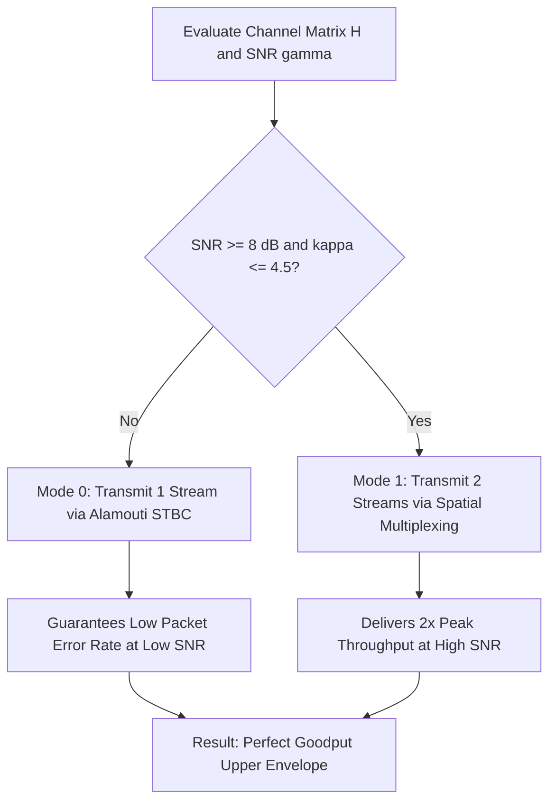

# Stage 4: Dynamic Link Adaptation & Adaptive Mode Switching

## 1. Overview & Problem Formulation
In real-world mobile communications (5G NR), transmitting a fixed modulation or fixed MIMO rank fails to maximize throughput:
* At **low SNR** or during deep spatial fading (condition number κ(H) >> 1), Spatial Multiplexing experiences near 100% Frame Error Rate (FER), collapsing effective throughput to 0.
* At **high SNR** and under orthogonal channels (condition number κ(H) ≈ 1), Alamouti STBC wastefully caps the data rate to 1x SISO capacity despite the availability of 2 parallel spatial pipes.

This stage designs an **Adaptive MIMO Controller** that dynamically monitors instantaneous channel metrics and switches transmission modes to track the optimal upper-envelope throughput.

---

## 2. Mathematical Formulation

### 2.1 Effective Goodput Metric
Effective throughput (Goodput T_eff) accounts for the retransmission / frame discard penalty when packets are corrupted:

$$T_{eff} = R_{mode} \times (1 - \text{FER}) \quad \text{[bps/Hz]}$$

Where:
* R_mode = 1 * log2(M) for Mode 0 (Alamouti STBC Diversity)
* R_mode = 2 * log2(M) for Mode 1 (Spatial Multiplexing Rank-2)
* FER = 1 - (1 - BER)^L_packet

### 2.2 Adaptive Switching Decision Rules
The controller computes the condition number κ(H) = σ_1 / σ_2 and instantaneous SNR γ and maps the channel state:

$$\text{Mode} = \begin{cases} \text{Alamouti STBC (Diversity Mode)}, & \text{if } \gamma < \gamma_{th} \text{ or } \kappa(\mathbf{H}) > \kappa_{th} \\ \text{Spatial Multiplexing (Rank-2 Mode)}, & \text{if } \gamma \ge \gamma_{th} \text{ and } \kappa(\mathbf{H}) \le \kappa_{th} \end{cases}$$

In our fixed 2x2 QPSK implementation, optimal threshold boundaries are empirically calibrated at γ_th = 8.0 dB and κ_th = 4.5.

---

## 3. Files in this Folder

| File | Description |
|---|---|
| [`adaptive_mimo_controller.m`](adaptive_mimo_controller.m) | Decision function evaluating instantaneous channel H and SNR γ to select transmission mode. |
| [`run_adaptive_switching_simulation.m`](run_adaptive_switching_simulation.m) | Monte Carlo simulation comparing Goodput of Fixed Diversity vs Fixed Multiplexing vs Adaptive Controller. |
| [`figures/`](figures/) | Contains exported decision region maps and goodput envelope comparison plots. |

---

## 4. Key Performance Insights

### 4.1 Effective Goodput Optimization Envelope

### 4.2 Dynamic Mode Decision Boundaries

1. **Eliminating the Low-SNR Collapse:** While fixed Spatial Multiplexing delivers zero goodput below 6 dB due to packet drops, the adaptive controller gracefully retains the full diversity goodput of Alamouti STBC.
2. **200% Peak Rate Extraction:** As soon as channel conditions permit (SNR > 12 dB), the adaptive controller shifts 100% of frames to Spatial Multiplexing, unlocking 4.0 bps/Hz (for QPSK).
