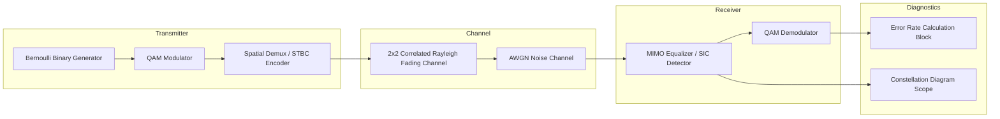

# Stage 5: Advanced Non-Linear Receivers & Simulink System Testbench

## 1. Overview
Linear detectors (ZF and MMSE) process all multiplexed spatial streams simultaneously. While computationally lightweight, linear detectors do not achieve the full receive diversity order (N_r - N_t + 1 = 1 in a 2x2 system).

This stage implements:
1. **Ordered MMSE Successive Interference Cancellation (MMSE-SIC / V-BLAST):** A non-linear decision-feedback receiver that strips off interference stream-by-stream.
2. **Simulink System Architecture:** An end-to-end block diagram model implementing transmission, fading channel, equalizers, constellation scopes, and real-time error rate calculation.

---

## 2. Mathematical Formulation of MMSE-SIC (V-BLAST)

### 2.1 Optimal Stream Ordering
In a 2x2 MIMO system with y = Hx + n, the post-detection Signal-to-Interference-plus-Noise Ratio (SINR) for stream i is:

```math
\text{SINR}_i = \frac{1}{\left[ (\mathbf{H}^H\mathbf{H} + \sigma_n^2 N_t \mathbf{I}_{N_t})^{-1} \right]_{i,i}} - 1
```

The receiver detects the stream with the highest SINR first:

```math
k_1 = \arg\max_{i \in \{1, 2\}} \text{SINR}_i
```

### 2.2 Interference Cancellation & Second Stage Detection
1. **Estimate first stream:**

```math
\hat{s}_{k_1} = \mathcal{Q} \left( \mathbf{w}_{k_1}^H \mathbf{y} \right)
```

where Q(·) denotes constellation slicing and decision.

2. **Subtract interference from received signal vector:**

```math
\mathbf{y}_2 = \mathbf{y} - \mathbf{h}_{k_1} \hat{s}_{k_1} = \mathbf{h}_{k_2} s_{k_2} + \mathbf{n}
```

3. **Detect second stream via Maximum Ratio Combining (MRC):**

```math
\hat{s}_{k_2} = \mathcal{Q} \left( \frac{\mathbf{h}_{k_2}^H \mathbf{y}_2}{\|\mathbf{h}_{k_2}\|^2 + \sigma_n^2} \right)
```

* **Diversity Enhancement:** The first stream is detected with diversity order N_r - N_t + 1 = 1, but after cancellation, the second stream is detected with full receive diversity order N_r = 2.

---

## 3. Simulink Block Diagram Architecture



### Simulink Block Diagram Model Overview


### Simulink Block Parameters
* **Binary Generator:** Sample time T_s = 1e-6 s, Probability of zero = 0.5.
* **MIMO Channel Block:** Rayleigh multipath flat-fading, 2 inputs, 2 outputs with Kronecker spatial correlation R_Tx, R_Rx.
* **Constellation Diagram:** Displays real-time I/Q scatter before and after equalization.

---

## 4. Performance Results: Non-Linear MMSE-SIC vs Linear Detectors


* **Interference Cancellation Gain:** Successive Interference Cancellation yields a 2.5 dB performance gain at BER = 1e-3 compared to linear MMSE, substantially reducing error propagation.

---

## 5. Live Waveform & Constellation Diagnostic Instrument

In addition to BER curves, the system provides an interactive diagnostic scope showing time-domain waveforms, received faded signals, transmitter/receiver scatter constellations, MMSE-SIC equalized clusters, and water-filling power tanks:


To run this instrument directly in MATLAB:
```matlab
visualize_waveforms_and_constellations
```

---

## 6. Files in this Folder

| File | Description |
|---|---|
| [`mmse_sic_detector.m`](mmse_sic_detector.m) | Non-linear ordered MMSE-SIC (V-BLAST) detection function. |
| [`run_sic_simulation.m`](run_sic_simulation.m) | Monte Carlo simulation runner comparing MMSE-SIC vs Linear MMSE vs ZF. |
| [`build_simulink_model.m`](build_simulink_model.m) | Parameter setup and initialization script for the Simulink model. |
| [`create_and_export_simulink_model.m`](create_and_export_simulink_model.m) | Script creating and configuring the physical Simulink block diagram. |
| [`figures/`](figures/) | Exported figures and BER curves comparing linear and non-linear receivers. |
