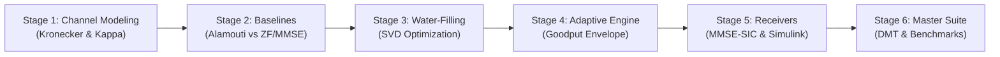

# 5G MIMO Multiplexing Optimization Project — Implementation Plan

> **Academic Course**: ECL DC 401 — Mobile Communication  
> **Topic**: MIMO Diversity vs. Spatial Multiplexing Optimization in 5G Wireless Links  
> **Key Directive (Prof. Feedback)**: *"Multiplexing efficiencies — optimize for fixed no. of MIMO"*  
> **Platform**: MATLAB & Simulink (R2020a - R2026a+) | Native Tool-Free Portability  
> **Repository**: [https://github.com/anupamsarashwat1-cloud/Mobile-communication-project](https://github.com/anupamsarashwat1-cloud/Mobile-communication-project)

---

## 1. Project Objectives & Mathematical Framework

The core scientific goal is to resolve the fundamental trade-off between **Spatial Diversity** (reliability/robustness, maximizing diversity order $d$) and **Spatial Multiplexing** (throughput/spectral efficiency, maximizing multiplexing gain $r$) for a **fixed $2 \times 2$ MIMO antenna configuration**.

$$\mathbf{y} = \mathbf{H}\mathbf{x} + \mathbf{n}, \quad \mathbf{H} \in \mathbb{C}^{2 \times 2}, \quad \mathbf{n} \sim \mathcal{CN}(0, \sigma^2 \mathbf{I}_2)$$

### Key Mathematical Pillars:
1. **Spatial Correlation (Kronecker Model)**:
   $$\mathbf{H} = \mathbf{R}_{rx}^{1/2} \mathbf{H}_{w} \mathbf{R}_{tx}^{1/2}$$
2. **Channel Condition Number ($\kappa(\mathbf{H})$)**:
   $$\kappa(\mathbf{H}) = \frac{\sigma_{max}(\mathbf{H})}{\sigma_{min}(\mathbf{H})}$$
3. **Singular Value Decomposition & Optimal Water-Filling**:
   $$\mathbf{H} = \mathbf{U} \mathbf{\Sigma} \mathbf{V}^H, \quad P_i^* = \left( \mu - \frac{\sigma_n^2}{\sigma_i^2} \right)^+, \quad \sum_{i=1}^{r} P_i^* = P_{total}$$
4. **Adaptive Rank Switching**:
   $$\text{Mode} = \begin{cases} \text{Rank-2 (Spatial Multiplexing)}, & \text{if } \text{SNR} \ge \gamma_{th} \text{ and } \kappa(\mathbf{H}) \le \kappa_{th} \\ \text{Rank-1 (Alamouti STBC Diversity)}, & \text{otherwise} \end{cases}$$
5. **Ordered Non-Linear Successive Interference Cancellation (MMSE-SIC / V-BLAST)**:
   Cancels the strongest stream post-MMSE filtering to achieve full second-order diversity on the remaining stream.
6. **Zheng-Tse Diversity-Multiplexing Trade-off (DMT) Bound**:
   $$d^*(r) = (N_t - r)(N_r - r) = (2-r)^2$$

---

## 2. Six-Stage Architecture & Deliverables

| Stage | Script / Model | Description | Output Figures |
|---|---|---|---|
| **Stage 1** | `01_channel_modeling/test_channel_statistics.m` | Correlated Rayleigh MIMO channel generation, SVD decomposition, and condition number $\kappa(\mathbf{H})$ distribution. | `singular_value_pdf.png` `condition_number_vs_correlation.png` |
| **Stage 2** | `02_baseline_transceivers/run_baseline_comparison.m` | Uncoded 2x2 Spatial Multiplexing (ZF & MMSE) vs 2x2 Alamouti STBC Diversity ($d=4$). | `alamouti_vs_sm_ber.png` `zf_noise_amplification_analysis.png` |
| **Stage 3** | `03_optimization_svd_waterfilling/run_capacity_optimization.m` | SVD eigen-beamforming and exact iterative water-filling power allocation. | `capacity_wf_vs_equal_power.png` `capacity_gain_vs_correlation.png` |
| **Stage 4** | `04_adaptive_mode_switching/run_adaptive_switching_simulation.m` | Dynamic rank-adaptation controller based on instantaneous SNR and condition number $\kappa(\mathbf{H})$. | `effective_goodput_envelope.png` `mode_switching_decision_boundary.png` |
| **Stage 5** | `05_simulink_and_advanced_receivers/run_sic_simulation.m` | Non-linear Ordered MMSE-SIC (V-BLAST) receiver and Simulink model synthesis. | `sic_vs_linear_receivers_ber.png` `simulink_model_overview.png` |
| **Stage 6** | `06_master_runner_and_benchmarks/main_benchmark_suite.m` | Unified master simulation runner, Zheng-Tse DMT theoretical bound, and 4-panel dashboard. | `master_comprehensive_summary.png` `dmt_diversity_multiplexing_curve.png` |

---

## 3. Terminal & GUI Execution Matrix

All scripts can be executed through:
1. **Interactive MATLAB App**: `gui_dashboard` (one-click buttons with embedded plotting).
2. **Terminal PowerShell Batch**: `matlab -batch "run('06_master_runner_and_benchmarks/main_benchmark_suite.m');"`
3. **MATLAB Online**: Run scripts directly in browser after cloning.
