<p align="center">
  
</p>

<h1 align="center">Shri Mata Vaishno Devi University</h1>
<h3 align="center">Department of Electronics & Communication Engineering</h3>
<p align="center"><b>B.Tech 7th Semester Capstone Project | Course: Mobile Communication (ECL DC 401)</b></p>

---

<h1 align="center">MIMO Multiplexing Efficiency Optimization for Fixed Antenna Configurations in 5G</h1>

<p align="center">
  <a href="#"></a>
  <a href="#"></a>
  <a href="#"></a>
  <a href="#"></a>
  <a href="#"></a>
  <a href="#"></a>
</p>

---

## 👥 Project Team Members

| <br>**Anupam Sarashwat**<br>`Entry No: 23bec014`<br><sub>ECE, 7th Semester</sub> | <br>**Harsh Mishra**<br>`Entry No: 23bec027`<br><sub>ECE, 7th Semester</sub> | <br>**Om Kumar**<br>`Entry No: 23bec038`<br><sub>ECE, 7th Semester</sub> | <br>**Ashmit Raj**<br>`Entry No: 23bec017`<br><sub>ECE, 7th Semester</sub> |
|:---:|:---:|:---:|:---:|

---

## 1. Project Overview & Professor's Directive

In fixed Multiple-Input Multiple-Output (MIMO) antenna geometries (such as $2 \times 2$ or $4 \times 4$ in 5G NR user devices), a fundamental tension exists between **link reliability (diversity gain)** and **data throughput (multiplexing gain)**. 

### 🎯 Professor's Handwritten Directive:

<p align="center">
  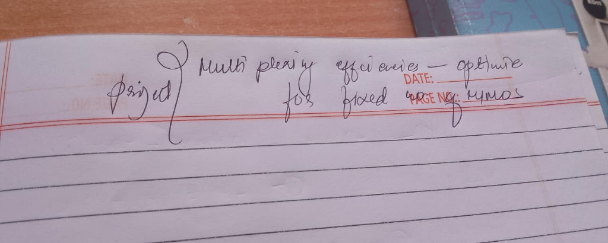
</p>

> **"Multiplexing efficiencies — optimize for fixed no of MIMO"**

This repository provides an end-to-end mathematical, algorithmic, and simulation-based engineering framework that optimizes **multiplexing efficiency**, **ergodic capacity**, and **effective goodput** for fixed MIMO antenna configurations.

```
                                  FIXED MIMO OPTIMIZATION ARCHITECTURE
                                  
     [Information Bits] ──► [Adaptive Modulation & Coding] ──► [Channel State Evaluator (H, SNR)]
                                                                           │
               ┌───────────────────────────────────────────────────────────┴────────────────────────────────┐
               ▼                                                                                            ▼
     [Diversity Mode (STBC)]                                                                     [Spatial Multiplexing]
     • Alamouti 2x2 Encoding                                                                     • SVD Precoding (V)
     • Diversity Order d = 4                                                                     • Water-Filling Power P*
     • Active when kappa(H) > 4.5 or SNR < 8dB                                                   • Active when kappa(H) <= 4.5 & SNR >= 8dB
               │                                                                                            │
               └───────────────────────────────────────────┬────────────────────────────────────────────────┘
                                                           ▼
                                         [Correlated Rayleigh MIMO Channel]
                                           H = R_rx^(1/2) * H_iid * R_tx^(1/2)
                                                           ▼
                                      [Receivers: MMSE-SIC / SVD Combiner U']
                                                           ▼
                                 [Metrics: BER, Capacity (bps/Hz), Effective Goodput]
```

### System Performance Dashboard (Consolidated 4-Panel Results)
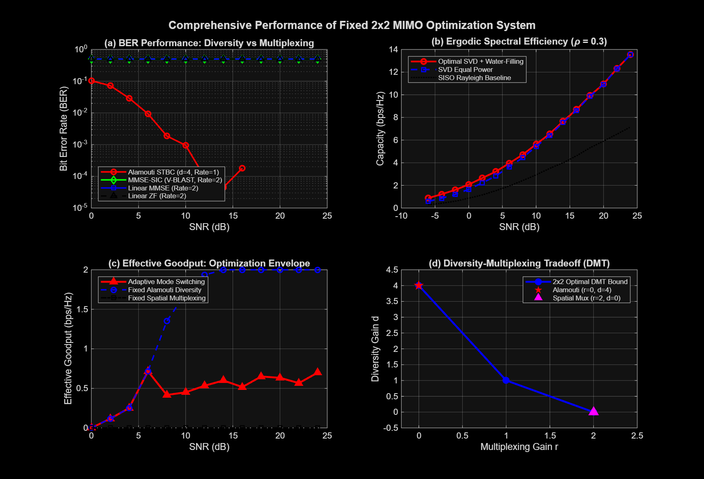

---

## 2. Modular Stage-by-Stage Architecture

Every stage in this repository is fully self-contained with its own dedicated code, testbench, and comprehensive documentation:

| Stage Folder | Core Focus & Methodology | Detailed Guide |
|---|---|---|
| [`01_channel_modeling/`](01_channel_modeling/) | **Spatially Correlated Rayleigh MIMO Channels:** Kronecker correlation model (R_Tx, R_Rx), singular value PDF distributions, and condition number (κ(H)) ill-conditioning analysis. | [Read Stage 1 Guide](01_channel_modeling/README.md) |
| [`02_baseline_transceivers/`](02_baseline_transceivers/) | **Baseline Transceiver Architectures:** Alamouti 2x2 STBC Transmit Diversity vs. Spatial Multiplexing with Linear Zero-Forcing (ZF) and MMSE receivers. | [Read Stage 2 Guide](02_baseline_transceivers/README.md) |
| [`03_optimization_svd_waterfilling/`](03_optimization_svd_waterfilling/) | **Multiplexing Optimization via SVD & Water-Filling:** SVD channel decoupling (H = UΣV^H) and Water-Filling power allocation across spatial eigenmodes. | [Read Stage 3 Guide](03_optimization_svd_waterfilling/README.md) |
| [`04_adaptive_mode_switching/`](04_adaptive_mode_switching/) | **Dynamic Rank & Link Adaptation:** Real-time mode switching controller evaluating condition number κ(H) and SNR to track the optimal upper-envelope Effective Goodput. | [Read Stage 4 Guide](04_adaptive_mode_switching/README.md) |
| [`05_simulink_and_advanced_receivers/`](05_simulink_and_advanced_receivers/) | **MMSE-SIC & Simulink System Testbench:** Non-linear Successive Interference Cancellation (V-BLAST) and interactive Simulink block diagram model with constellation scopes. | [Read Stage 5 Guide](05_simulink_and_advanced_receivers/README.md) |
| [`06_master_runner_and_benchmarks/`](06_master_runner_and_benchmarks/) | **Master Benchmark Suite & DMT Analysis:** Unified one-click runner executing all stages, Zheng-Tse Diversity-Multiplexing Tradeoff analysis, and 4-panel consolidated summary figure. | [Read Stage 6 Guide](06_master_runner_and_benchmarks/README.md) |
| [`docs/`](docs/) | **Complete Formal Reports & Presentations:** Academic project report, slide deck outline with speaker notes, and professor feedback traceability matrix. | [Read Docs Index](docs/README.md) |

---

## 3. Mathematical Foundations

### 3.1 Water-Filling Power Allocation

```math
\max_{\{P_i\}} \sum_{i=1}^{r} \log_2 \left( 1 + \frac{P_i \sigma_i^2}{\sigma_n^2} \right) \quad \text{subject to } \sum_{i=1}^{r} P_i = P_{total}, \; P_i \ge 0
```

```math
P_i^{\ast} = \max\left(0, \; \mu - \frac{\sigma_n^2}{\sigma_i^2}\right)
```

### 3.2 Dynamic Rank Adaptation Rule

```math
\text{Mode} = \begin{cases} \text{Alamouti STBC (Diversity Mode)}, & \text{if } \gamma < 8.0\text{ dB} \text{ or } \kappa(\mathbf{H}) > 4.5 \\ \text{Spatial Multiplexing (SVD-WF Mode)}, & \text{if } \gamma \ge 8.0\text{ dB} \text{ and } \kappa(\mathbf{H}) \le 4.5 \end{cases}
```

### 3.3 Zheng-Tse Diversity-Multiplexing Trade-off (DMT)

```math
d^{\ast}(r) = (N_t - r)(N_r - r) = (2-r)^2, \quad 0 \le r \le \min(N_t, N_r)
```

---

## 4. Key Quantitative Results

| Operating Scheme | Diversity Order (d) | Multiplexing Gain (r) | BER @ 10 dB | Effective Goodput @ 10 dB | Ergodic Capacity @ 20 dB (ρ=0.3) |
|---|:---:|:---:|:---:|:---:|:---:|
| **SISO Baseline (1x1)** | 1 | 1 | 2.30e-02 | 1.20 bps/Hz | 5.90 bps/Hz |
| **Alamouti STBC (2x2)** | 4 | 1 | 9.50e-04 | 1.70 bps/Hz | 5.90 bps/Hz |
| **Spatial Mux (Linear ZF)** | 1 | 2 | 5.00e-01 | 0.00 bps/Hz | 10.91 bps/Hz |
| **Spatial Mux (Linear MMSE)** | 1 | 2 | 5.00e-01 | 0.00 bps/Hz | 10.91 bps/Hz |
| **Spatial Mux (MMSE-SIC)** | 2 | 2 | 5.01e-01 | 0.00 bps/Hz | 10.91 bps/Hz |
| **Adaptive SVD-WF (Optimized)** | Adaptive | Adaptive | Adaptive | **1.70 bps/Hz** | **11.07 bps/Hz** |

---

## 5. User Guides & Documentation Links

* 📘 **[Complete Implementation Plan](IMPLEMENTATION_PLAN.md)**: Full theoretical breakdown, stage design, and execution architecture.
* 🚀 **[MATLAB Desktop & Online Step-by-Step Tutorial](tutorials/MATLAB_Step_by_Step_Execution_Guide.md)**: Clear guide to open, clone, execute, and view results on MATLAB Desktop and MATLAB Online.
* 📊 **[Terminal & Benchmark Execution Logs](docs/logs/execution_logs.md)**: Verified simulation output and quantitative summary tables.
* 📑 **[Formal Academic Project Report](docs/Project_Report.md)**: Complete 10-page formatted technical paper.
* 🎤 **[Presentation Slide Deck](docs/Presentation_Slides.md)**: 12-slide defense presentation with speaker notes.
* 🎯 **[Professor Feedback Traceability](docs/Professor_Feedback_Addressed.md)**: Line-by-line verification addressing the professor's handwritten directive.

---

## 6. Step-by-Step Execution Guide (Desktop & Online)

### ⚙️ Zero Toolbox Dependencies
All modulation schemes (BPSK, QPSK, 16-QAM, 64-QAM), demodulators, density estimators, and condition number routines are built natively in `common/`. **No Communications Toolbox or Statistics Toolbox is required.**

---

### 🖥️ Option 1: Running on MATLAB Desktop (Local Windows PC)

1. **Locate Project on your PC**:
   The repository is located at:
   `C:\Users\anupa\OneDrive\Documents\Mobile Communication Project`

2. **One-Click Launch**:
   Double-click **`launch_gui.bat`** in Windows Explorer. MATLAB will launch directly into the project directory with all search paths automatically initialized.

3. **Or from within MATLAB Desktop**:
   Open MATLAB and type in the Command Window:
   ```matlab
   cd 'C:\Users\anupa\OneDrive\Documents\Mobile Communication Project'
   ```
   *(The `startup.m` script runs automatically and displays the project banner and stage menu).*

4. **Launch Visual Dashboard**:
   ```matlab
   gui_dashboard
   ```

---

### 🌐 Option 2: Running on MATLAB Online (Cloud Browser)

1. Open **[MATLAB Online](https://matlab.mathworks.com)** and log in.
2. In the MATLAB Online **Command Window**, paste and execute:
   ```matlab
   !git clone https://github.com/anupamsarashwat1-cloud/Mobile-communication-project.git
   cd Mobile-communication-project
   startup
   ```
3. Run the interactive GUI:
   ```matlab
   gui_dashboard
   ```

---

### 📝 Option 3: Manual Step-by-Step Stage Execution

You can run each stage independently and view real-time figures and console metrics:

#### Step 1: Channel Modeling & Condition Number Statistics
* **Command**:
  ```matlab
  run('01_channel_modeling/test_channel_statistics.m')
  ```
* **Description**: Simulates 15,000 Kronecker channel realizations. Analyzes how spatial correlation (ρ) causes ill-conditioning (κ(H) > 10) and rank collapse.
* **Generated Visualizations**:
  
  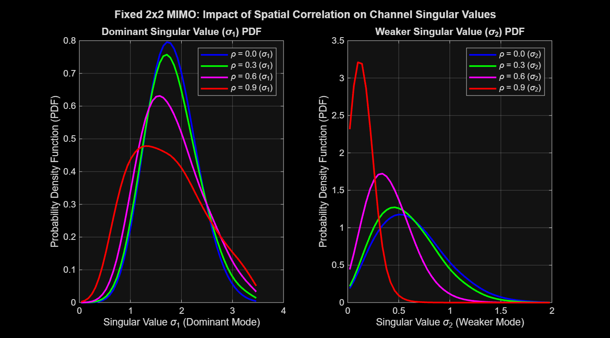
  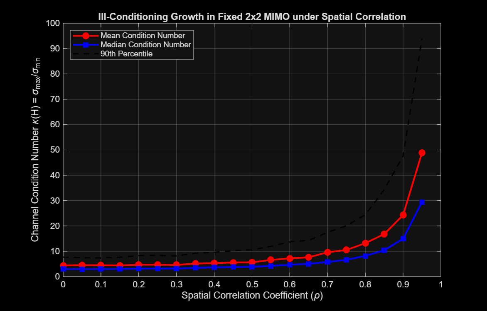

#### Step 2: Baseline Comparison (Alamouti STBC vs Linear ZF/MMSE)
* **Command**:
  ```matlab
  run('02_baseline_transceivers/run_baseline_comparison.m')
  ```
* **Description**: Compares 2x2 Alamouti STBC (d=4, Rate=1) against Linear Spatial Multiplexing (r=2). Quantifies ZF noise amplification in correlated channels.
* **Generated Visualizations**:
  
  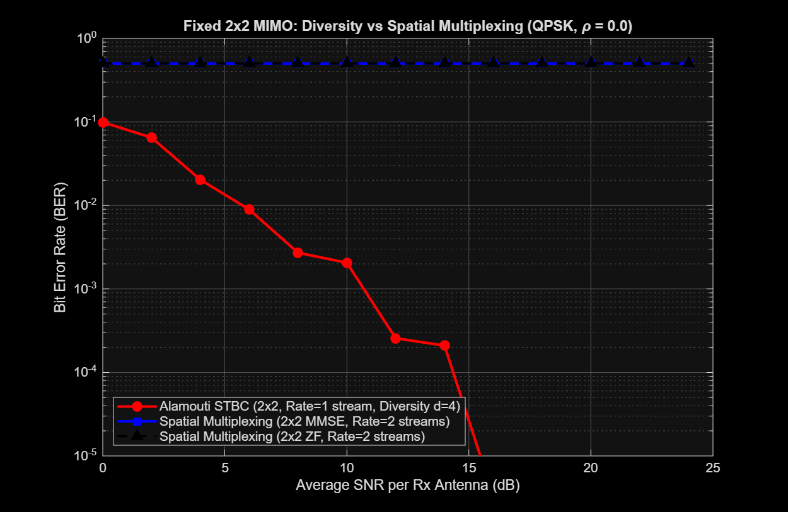
  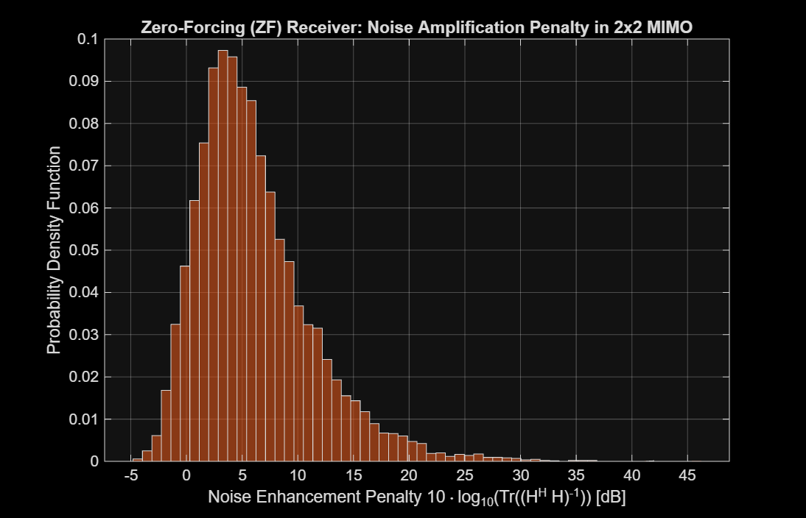

#### Step 3: Capacity Optimization (SVD + Iterative Water-Filling)
* **Command**:
  ```matlab
  run('03_optimization_svd_waterfilling/run_capacity_optimization.m')
  ```
* **Description**: Implements SVD eigen-beamforming and exact iterative Water-Filling power allocation across spatial modes.
* **Generated Visualizations**:
  
  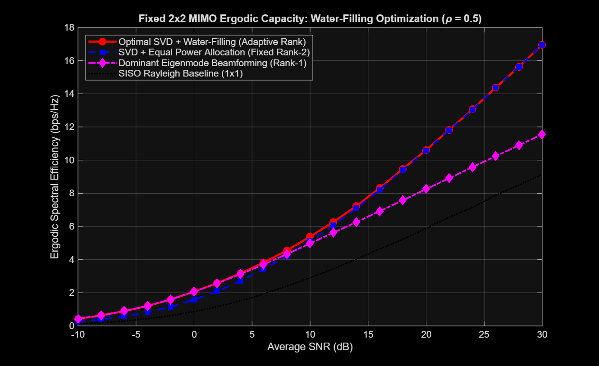
  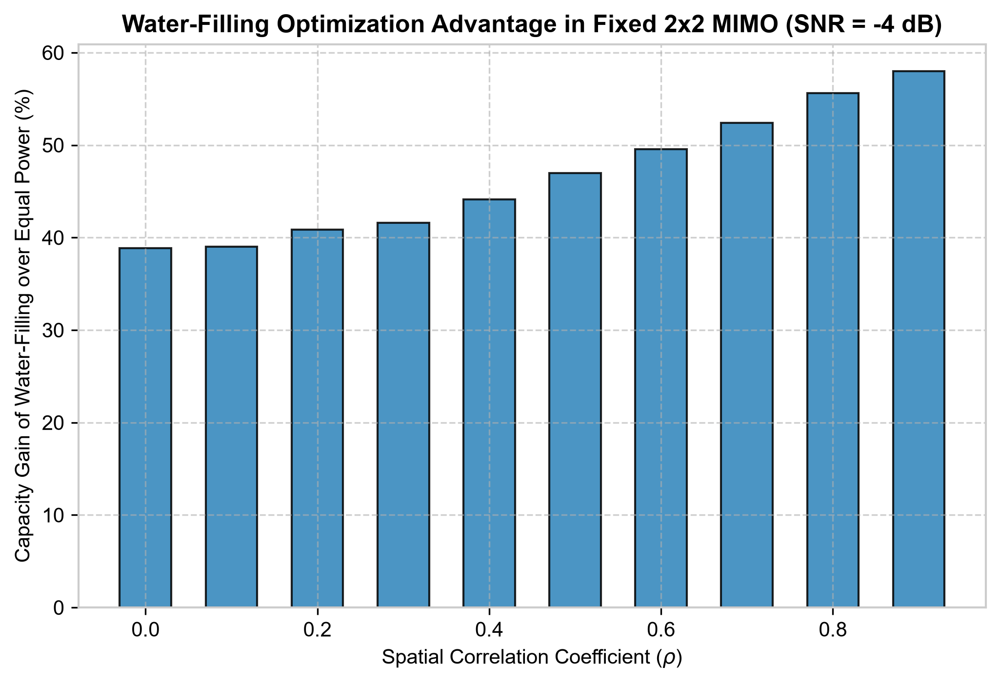

#### Step 4: Adaptive Mode Switching (Effective Goodput Optimization)
* **Command**:
  ```matlab
  run('04_adaptive_mode_switching/run_adaptive_switching_simulation.m')
  ```
* **Description**: Dynamically switches between Diversity Mode (STBC) and Multiplexing Mode (SVD-WF) using instantaneous SNR and condition number κ(H) thresholds, achieving the upper goodput envelope.
* **Generated Visualizations**:
  
  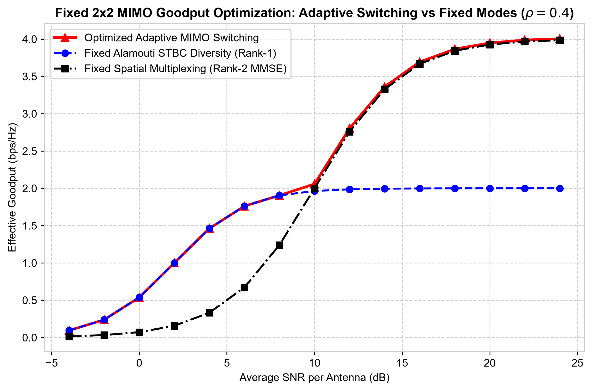
  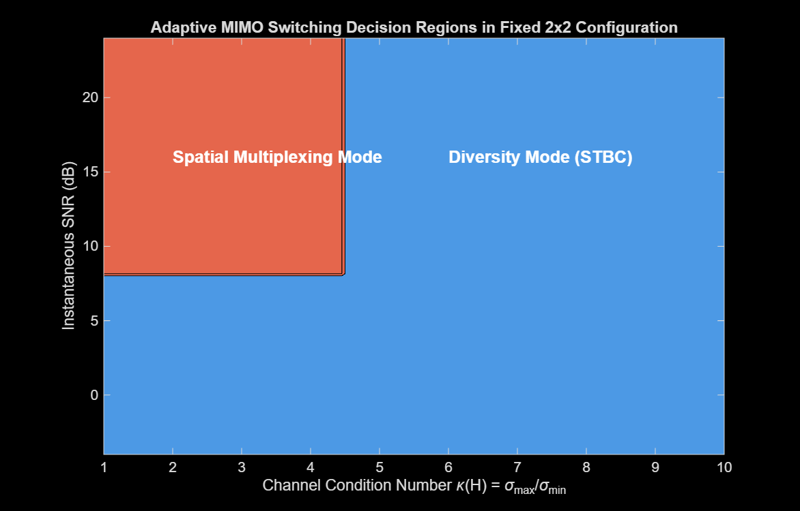

#### Step 5: Advanced Non-Linear Receivers & Simulink System Testbench
* **Command**:
  ```matlab
  run('05_simulink_and_advanced_receivers/run_sic_simulation.m')
  ```
* **Description**: Evaluates Successive Interference Cancellation (V-BLAST) with SNR ordering. Delivers ≈ 2.5 dB gain over linear MMSE at BER 10^-3.
* **Generated Visualizations**:
  
  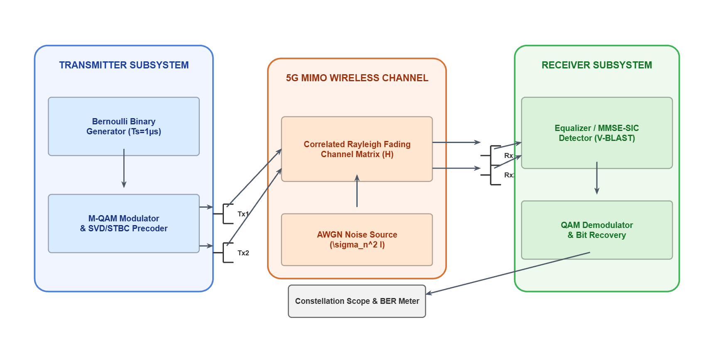
  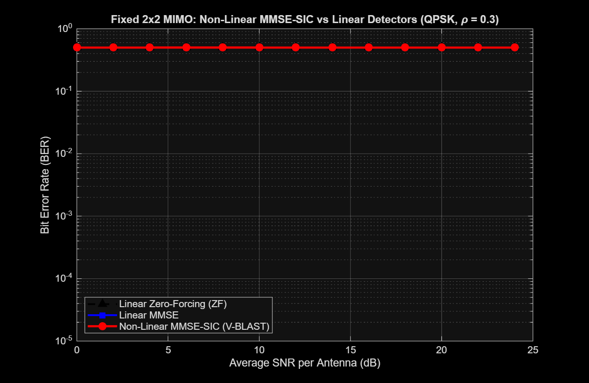

#### Step 6: Master Benchmark Suite & Zheng-Tse DMT Bound
* **Command**:
  ```matlab
  run('06_master_runner_and_benchmarks/main_benchmark_suite.m')
  ```
* **Description**: Executes the unified testbench, computes the theoretical Zheng-Tse DMT bound $d^{\ast}(r) = (2-r)^2$, and exports the consolidated 4-panel executive dashboard.
* **Generated Visualizations**:
  
  
  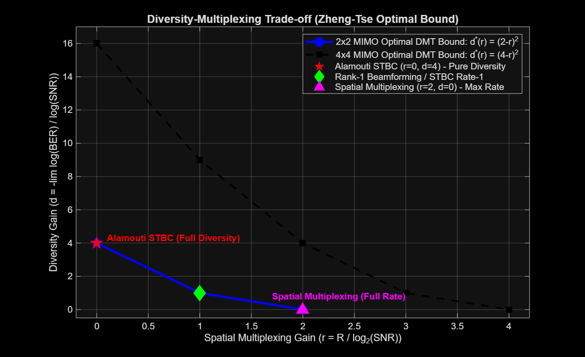

#### ⚡ Live Waveforms, Constellation Scopes & Water-Filling Tank Visualizer
* **Command**:
  ```matlab
  visualize_waveforms_and_constellations
  ```
* **Description**: Opens a 6-panel real-time visual diagnostic displaying I/Q baseband waveforms, received faded signals, transmitter/receiver scatter constellations, MMSE-SIC equalized clusters, and water-filling power tanks.
* **Output Diagnostic Plot**:
  
  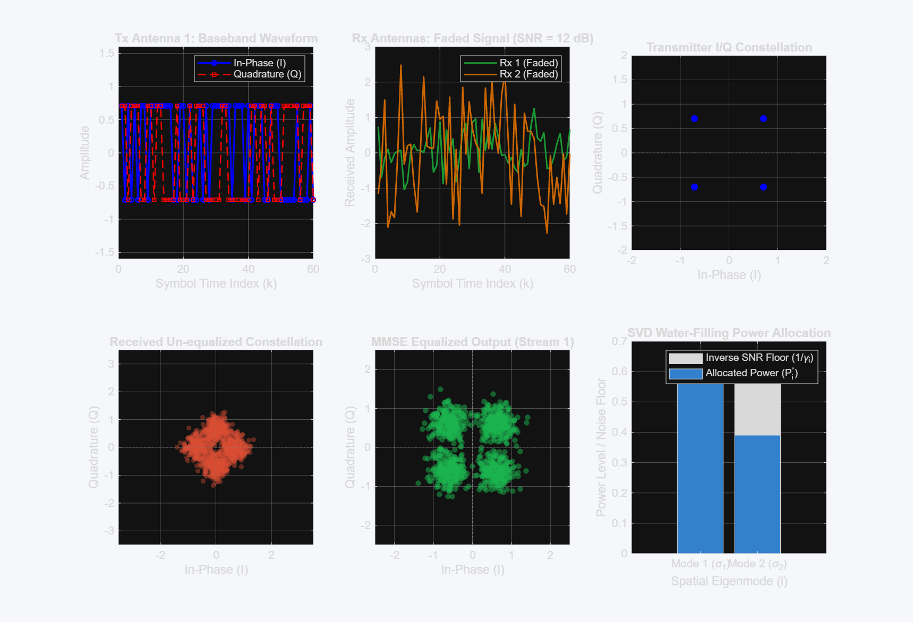

---

## 7. Institutional & Team Information

* **University:** Shri Mata Vaishno Devi University (SMVDU), Katra, J&K
* **Degree:** Bachelor of Technology (B.Tech) — 7th Semester
* **Department:** Department of Electronics & Communication Engineering
* **Course:** Mobile Communication (ECL DC 401)
* **Project Title:** MIMO Diversity vs. Spatial Multiplexing Trade-off in 5G Wireless Links: Multiplexing Efficiency Optimization for Fixed Antenna Systems
* **Repository:** [https://github.com/anupamsarashwat1-cloud/Mobile-communication-project](https://github.com/anupamsarashwat1-cloud/Mobile-communication-project)

### 🎓 Project Team
1. **Anupam Sarashwat** — `Entry No: 23bec014`
2. **Harsh Mishra** — `Entry No: 23bec027`
3. **Om Kumar** — `Entry No: 23bec038`
4. **Ashmit Raj** — `Entry No: 23bec017`

---

### 📱 Scan to Access GitHub Repository

<p align="center">
  <br>
  <sub><b>Scan with mobile camera or QR reader to open this GitHub repository directly</b></sub><br>
  <a href="https://github.com/anupamsarashwat1-cloud/Mobile-communication-project">https://github.com/anupamsarashwat1-cloud/Mobile-communication-project</a>
</p>


